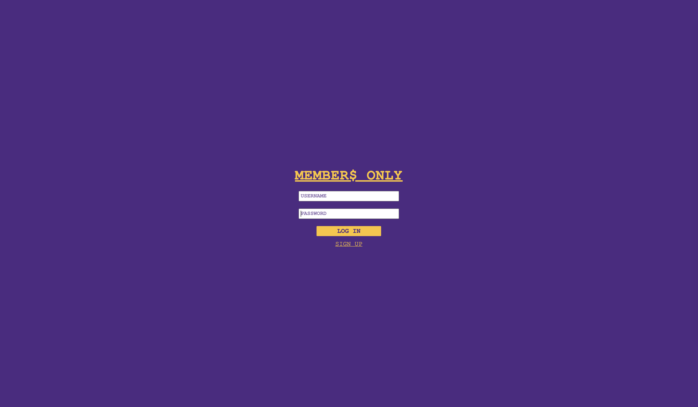

# Members Only

# 

## Table of contents

1. [Demo](#demo)
2. [Technologies](#technologies)
3. [Features](#features)
4. [Development](#development)
5. [License](#license)

## Demo

## Technologies

- Node/Express
- PassportJS
- EJS

## Features

- Secure Log In
- MongoDB

### Development

- Learn more about authentication and the different methods

## License

> You can check out the full license [here](LICENSE)

This project is licensed under the terms of the **MIT** license.
